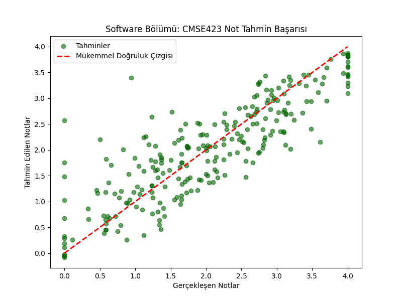

# Student Performance Predictor & Synthetic University Ecosystem

An analytical ecosystem designed to enhance academic visibility through stochastic simulations and data-driven projections. This project has evolved from a simple GPA calculator into a **versatile data science pipeline**.

---

## Completed Phases

### Phase 1: Deterministic GPA Engine 
* **Core Logic:** Implemented a robust parser for university transcripts (CSV format).
* **standardization:** Developed an automated mapping logic for letter-to-point conversion (e.g., A -> 4.0, B+ -> 3.3).

### Phase 2: Stochastic Student Generator 
* **Population Simulation:** Engineered a `StudentGenerator` class using **NumPy** to simulate a diverse population of 1,000+ students.
* **Statistical Modeling:** Applied a **Normal Distribution** $N(\mu=2.5, \sigma=0.7)$ to model realistic student abilities, ensuring a natural "Bell Curve" distribution.
* **Weighted Complexity:** Integrated department-specific difficulty weights (e.g., Software: 0.82, Architecture: 0.85) to mirror real-world academic rigor.

### Phase 2.5: Universal Data Adapter 
* **Schema Resilience:** Solved the "Data Inconsistency" problem between wide-format (synthetic data) and long-format (transcript records).
* **Data Wrangling:** Implemented a **Universal Adapter Layer** using Pandas `melt()` functionality to bridge disparate data structures dynamically.
* **Hybrid Processing:** Built a versatile grade processor that handles both categorical (A, B, C) and numerical (0.0 - 4.0) inputs seamlessly.

---

## Tech Stack

* **Language:** Python 3.12
* **Data Science:** Pandas, NumPy
* **Visualization:** Matplotlib, Seaborn
* **Version Control:** Git (Repository Discipline & .gitignore management)

---

## Future Roadmap

### Phase 3: Population Analytics & Visualization (Completed) 
* **University-Wide Distribution:** Generated a **KDE (Kernel Density Estimate)** and Histogram to visualize the academic "Bell Curve" across 10,000 students.
* **Comparative Insights:** Utilized **Box Plots** to analyze performance variance between different faculties (e.g., Software vs. Psychology).
* **Statistical Anchoring:** Integrated mean and median markers to identify systemic trends and potential "clipping" effects in grading.

### Phase 4: Predictive Modeling (Completed) 🚀
* **Model Selection:** Implemented a **Multiple Linear Regression** model using `scikit-learn`.
* **Feature Engineering:** Leveraged 30+ academic variables (course grades) to predict the outcome of high-stakes courses (e.g., CMSE423).
* **Performance Metrics:** Achieved a robust **R-Squared ($R^2$) score of 72.16%**, demonstrating high predictive accuracy despite intentional stochastic noise.
* **Residual Analysis:** Analyzed Mean Squared Error (MSE: 0.3277) to ensure the model's reliability across 10,000+ synthetic profiles.

---

##  ML Performance Insight
*The scatter plot below visualizes the high correlation between our model's predictions and actual synthetic outcomes:*

### Phase 5: Monte Carlo Risk Assessment
* Simulating 10,000+ scenarios to calculate the probability of a student falling below the critical **2.00 CGPA** threshold.

---

## Visual Insight
*The engine provides clear delta analysis between current academic status and simulated future scenarios:*

---
*Developed with focus on data integrity and predictive accuracy by [bratthan](https://github.com/bratthan).*