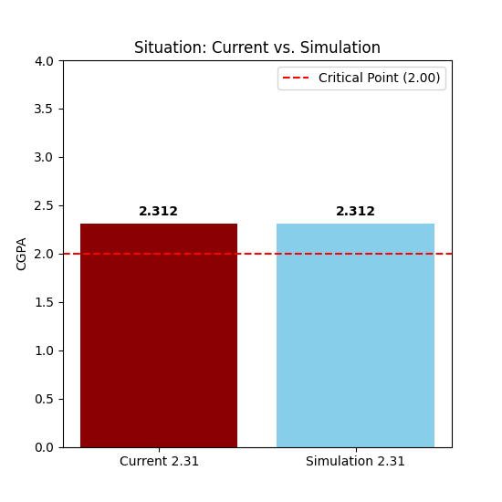
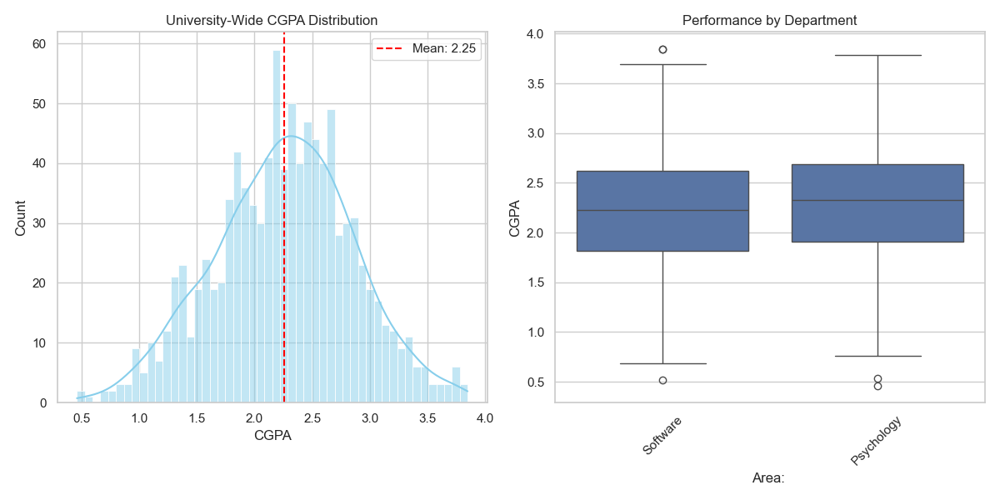
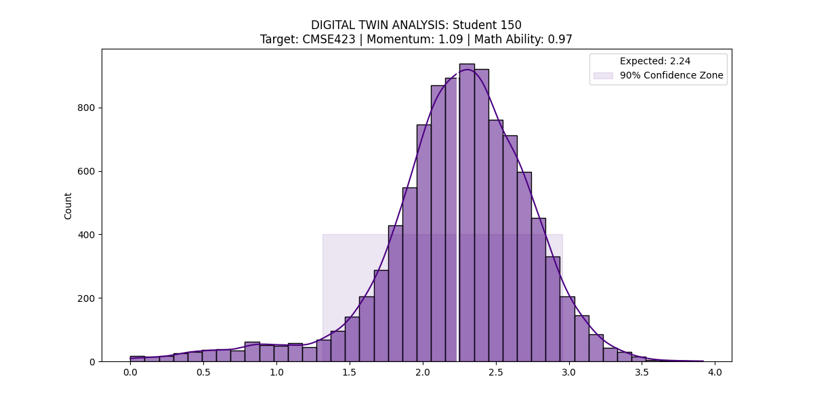

#  Student Performance Predictor & Academic Digital Twin

An advanced **Data Science** pipeline designed to simulate, analyze, and forecast academic performance. This project evolves from a simple GPA calculator into a sophisticated **Academic Digital Twin** using Monte Carlo simulations and Machine Learning.

---

##  Tech Stack
* **Language:** Python 3.12
* **Data Handling:** Pandas, NumPy
* **Machine Learning:** Scikit-Learn (Linear Regression)
* **Visualization:** Matplotlib, Seaborn
* **Statistical Modeling:** SciPy (Normal Distribution, Z-Score Analysis)

---

##  Project Phases

### Phase 1: Deterministic GPA Engine & Simulation
* **Core Logic:** Developed a robust parser for university transcripts.
* **Universal Adapter:** Handles both real transcripts and synthetic datasets.
* **Situation Analysis:** A "What-if" mode to see how specific course grades impact the overall CGPA.

---

### Phase 2: Realistic Student Generator
* **Stochastic Synthesis:** Generated a population of **5,000+ students** with realistic ability profiles.
* **Complexity Layers:** Integrated "Chain Effects" (prerequisites) and "Academic Shocks" (random failure risks).

---

### Phase 3: Population Analytics
* **EDA:** Analyzed the university's "Bell Curve" distribution using Seaborn.
* **Comparative Insights:** Used Box Plots to observe the difficulty gap between departments.

---

### Phase 4: Machine Learning (Predictive Modeling)
* **Algorithm:** Multiple Linear Regression.
* **Performance Report:**
    * **Success Rate (R2 Score):** %77.53
    * **Mean Squared Error (MSE):** 0.2527
* **Goal:** Predicting senior-level outcomes (e.g., CMSE423) based on 30+ prior course variables.

$$y = \beta_0 + \beta_1x_1 + \beta_2x_2 + \dots + \beta_nx_n + \epsilon$$

---

### Phase 5: Monte Carlo & Digital Twin Risk Engine
* **Digital Twin:** Constructs a virtual replica of a student's academic DNA using **Momentum** and **Inferred Abilities**.
* **Probabilistic Forecasting:** Runs **10,000 simulations** to create a probability distribution.
* **Confidence Zone:** Provides a **90% Confidence Interval** for professional-grade risk assessment.

---

##  Key Insights
1. **Academic Momentum:** The engine detects upward/downward trends in student progress.
2. **Chain Effect Logic:** Prerequisite success is mathematically tied to advanced course potential.
3. **Inconsistency Detection:** Identifies "unpredictable" academic paths through volatility analysis.

---
*Developed by **bratthan** - Bridging the gap between raw data and academic success.*